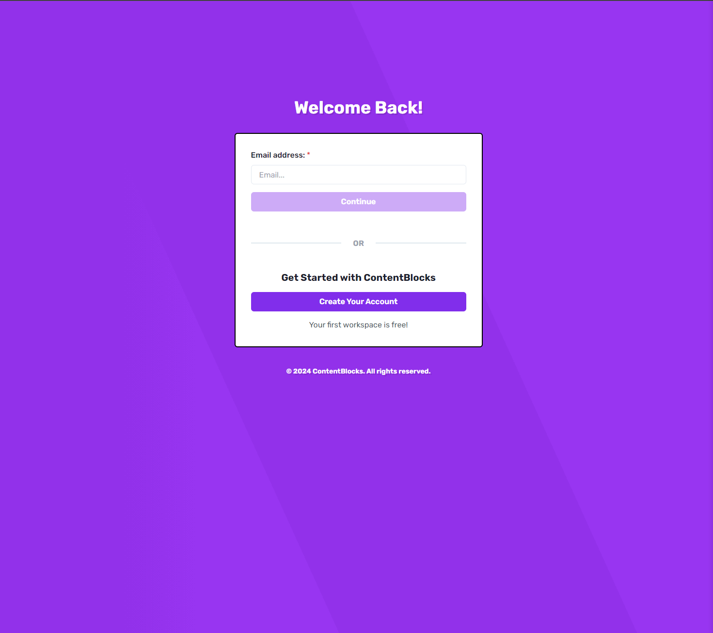
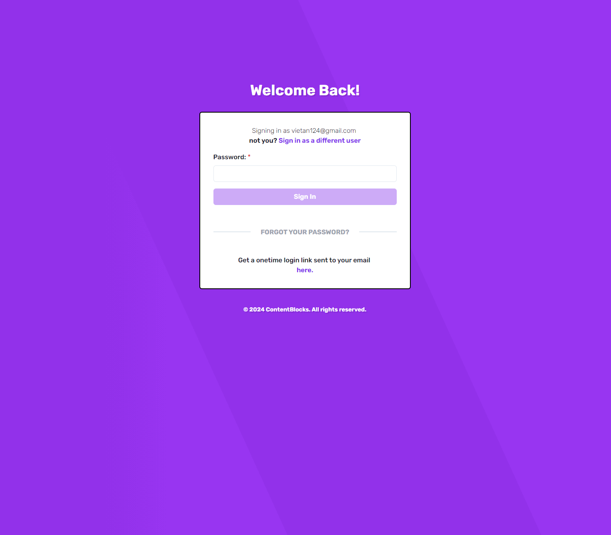
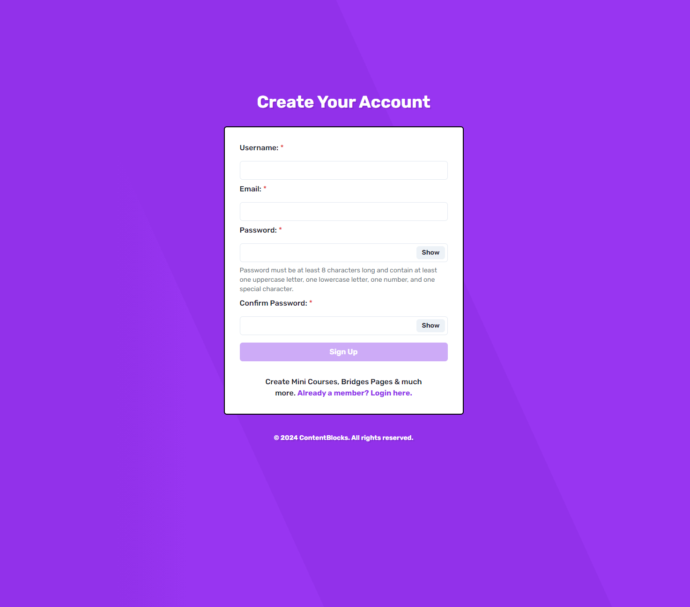

Hey Dan and/or Dylan! Had a lot of fun doing this take home test. Please find below the instructions on how to run the application.

## Getting Started

### First, copy and paste the values in the `.env.local` file provided in the email into the `.env.local.template` file at the root directory. Then, rename the file to `.env.local`. The file structure should look something like this:

```
 ┣ public
 ┣ src
 ┃ ┣ app
 ┃ ┣ ...
 ┣ .env.local
 ┣ ...
 ┣ package.json
 ┣ postcss.config.mjs
 ┣ README.md
 ┣ tailwind.config.ts
 ┗ tsconfig.json
```


Then, install all the dependencies:

```bash
npm install
```

Then, run the development server:

```bash
npm run dev
```

Open [http://localhost:3000](http://localhost:3000) with your browser to see the result.

## Details of sign-in and sign-up flow

### Sign in:
Root URL is simple as I want to focus on fully implementing the user auth flow with Clerk:


From here, user can click on Sign in button to go to the sign in page:



From here, if user already has an account, they can enter their email for verification, if a user is found with the provided email, they will be taken to the password stage:



From here, the users have two options, either log in with their password or use a magic link that will be sent to the provided email (feel free to try both options out, they are both fully implemented).

### Sign up:

From the sign in stage 1 page, users can create a new account if they don't have one yet, then they will be taken to the sign-up URL:



All screenshots of error handling can be found [here](./public/screenshots/)

